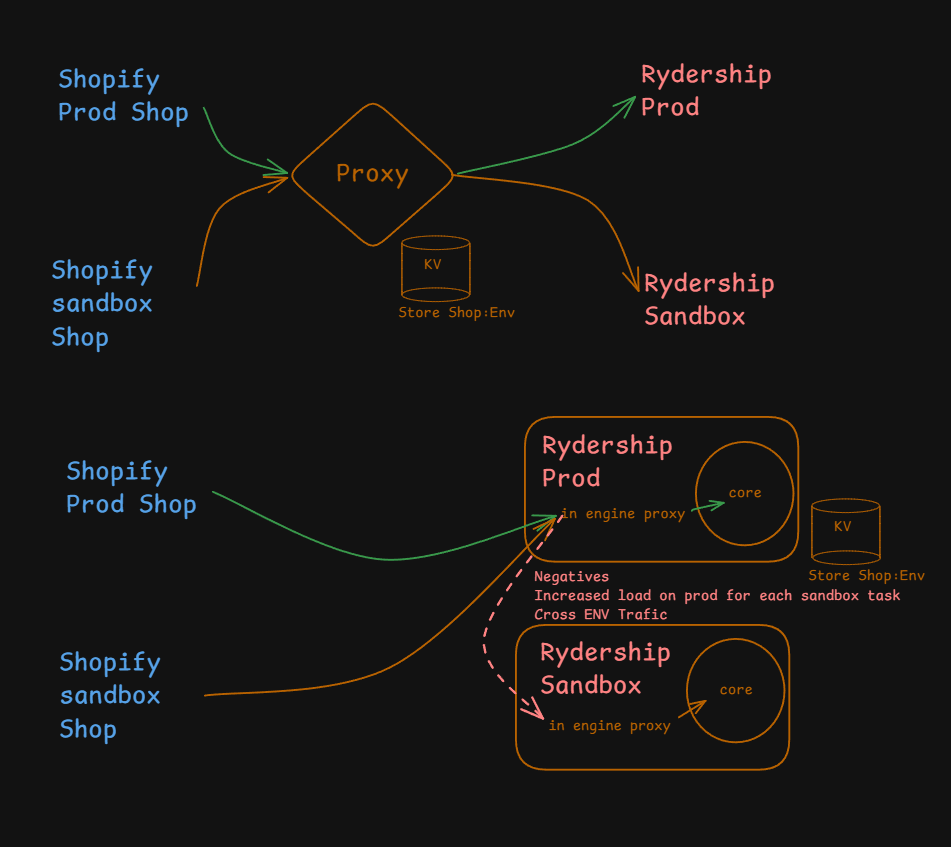

# External Proxy Argument

This is a POC of an **external, env-agnostic proxy** for a single Shopify app that lets
individual store installs point at different backend environments (production,
sandbox, …) without any environment-specific logic living in the app itself.

We'll review why this works, and the difference between an 'internal' proxy within the app and try to weight the pros and cons. Ultimately I'd like to prove that the ranking of options for shopify app development would be the external proxy, multiple shopify apps, and lastly an internal proxy in that order.

## Development

Install dependencies first (`pnpm install`), then use the scripts below.

| Command                 | What it does                                                           |
| ----------------------- | ---------------------------------------------------------------------- |
| `npm run dev`           | Run the Shopify app via the Shopify CLI (`shopify app dev`).           |
| `npm run dev:stack`     | Bring up the full local stack (app + proxy) via `scripts/dev.mjs`.     |
| `npm run dev:ngrok`     | Same stack, exposed through an ngrok tunnel (`scripts/dev-ngrok.mjs`). |
| `npm run dev:proxy`     | Run just the Nitro proxy in dev mode.                                  |
| `npm run build`         | Build the React Router app.                                            |
| `npm run build:proxy`   | Build the Nitro proxy.                                                 |
| `npm run preview:proxy` | Preview the built proxy.                                               |
| `npm run setup`         | Generate the Prisma client and apply migrations.                       |
| `npm run typecheck`     | Run React Router typegen and `tsc --noEmit`.                           |
| `npm run lint`          | Run ESLint.                                                            |
| `npm run deploy`        | Deploy the app config via the Shopify CLI.                             |

## What the POC is

The proxy is a thin, **stateless, env-agnostic router**
([`proxy/server/server.ts`](proxy/server/server.ts)). Per request it:

1. Resolves the shop (from `?shop=` or the App Bridge session-token `dest`) —
   [`proxy/server/utils/routing.ts`](proxy/server/utils/routing.ts).
2. Looks up that shop's chosen env in KV (could be redis or other kv store) and refreshes a
   sticky cookie so shopless subrequests (assets) stay on the same env.
3. Forwards the untouched request to whichever backend
   (`production` or `sandbox`) owns that shop.

The routing decision is **data, not code**. The proxy contains zero business
logic and never needs to know what the app does. Shopify sees **one app, one
stable URL**; the app instances stay pristine and identical to a normal
single-env deploy. A shop's environment is flipped through the proxy-owned
[`switch-env`](proxy/server/api/switch-env.post.ts) endpoint — no app redeploy.

## Two architectures



**Top — external proxy (this POC):** both the prod shop and the sandbox shop hit
a single `Proxy`, which reads the `Store Shop:Env` KV and forwards each request
**directly** to the one backend that owns it (Rydership Prod _or_ Rydership
Sandbox). One hop, no env ever calls another env.

**Bottom — built-in ("in-engine") proxy:** every request enters **Rydership
Prod** first, whose in-engine proxy decides the target and, for sandbox shops,
**bounces the request to Rydership Sandbox**. The whiteboard calls out the
negatives directly: _increased load on prod for each sandbox task_ and
_cross-ENV traffic_.

## Why external is preferential

When the routing logic lives _inside_ the production app, any sandbox-bound
request pays a **mandatory hop through production first**:

```
Sandbox Shopify store ──► Production app (entry)
                     └─ in-engine proxy logic runs on prod
                          └─ decides "this shop is sandbox"
                              └─ forwards to Sandbox app
                                   └─ sandbox in-engine proxy logic runs on sandbox
                                      └─ decides "this shop is sandbox" it can stay
                                          └─ sandbox does the real work
```

That creates three concrete problems, all avoided by the external proxy:

| Problem                 | Built-in proxy                                                                                                     | External proxy                                                                            |
| ----------------------- | ------------------------------------------------------------------------------------------------------------------ | ----------------------------------------------------------------------------------------- |
| **Cross-env traffic**   | Sandbox requests physically enter the production process before bouncing. Prod and sandbox are coupled at runtime. | Router forwards directly to the one target. No env ever calls another env.                |
| **Load on production**  | Prod absorbs CPU, connections, and log volume for _every_ sandbox request, even ones it does no real work for.     | Prod only sees prod traffic. Sandbox load never touches it.                               |
| **Extra hop / latency** | Guaranteed extra network hop for all non-prod traffic (store → prod → sandbox).                                    | One hop for everyone (store → proxy → target). Symmetric cost, no penalty for lower envs. |

### The deeper architectural reasons

1. **Blast radius / isolation.** In the built-in model, production is on the
   critical path for sandbox work — a bad sandbox deploy, routing bug, or
   sandbox load spike can degrade prod. The external proxy keeps production
   insulated.
2. **Separation of concerns.** Routing is infrastructure; the app is business
   logic. The external proxy lets you change env-assignment without touching or
   redeploying either app instance.
3. **The app stays a standard single-env app.** No "am I prod or sandbox, and
   should I forward this?" branching in application code — which is exactly
   where cross-env bugs (wrong DB, secrets, or webhook target) live.
4. **Bootstrapping.** A built-in proxy can only route once prod is up and
   healthy, making prod a hard dependency for reaching _any_ env. The external
   proxy has no such ordering constraint.
5. **Scaling and cost attribution.** Each env scales and is metered
   independently; production capacity planning isn't polluted by sandbox
   pass-through traffic.
6. **Symmetry and extensibility.** Adding a third env (staging, per-tenant
   preview, canary) is a one-line addition to `TARGETS` plus a KV entry — the
   new env doesn't have to be reached _through_ production.

### Summary

An external proxy treats environment selection as a stateless routing decision
made _before_ any app code runs, so each request takes exactly one hop to
exactly one backend, production never carries sandbox load or sits on the
sandbox critical path, and the app instances stay identical, env-agnostic, and
independently deployable. A built-in proxy inverts this: it makes production the
mandatory entry point and proxy host for every environment, adding a wasted hop,
cross-env runtime coupling, and extra production load for work production isn't
even doing — all to solve a routing problem that doesn't belong inside the app.
